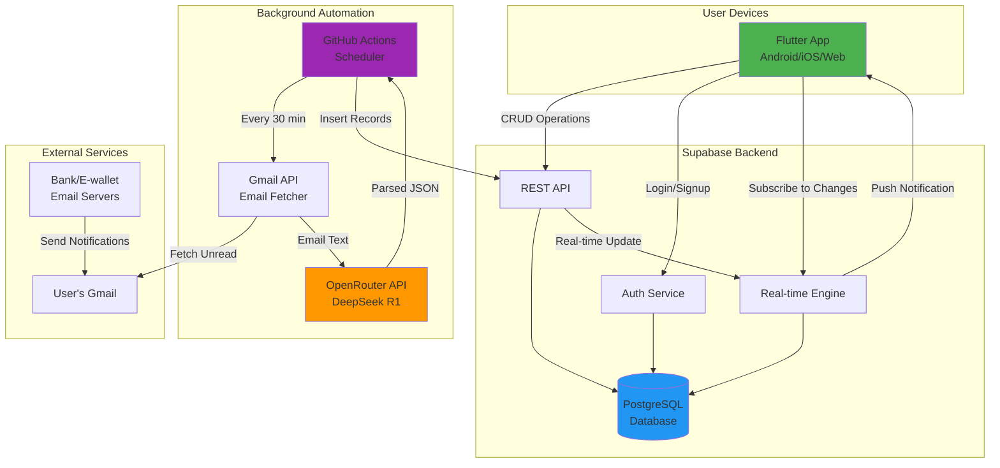

# Artha - Application Architecture

## Project Overview

**Artha** is a personal finance management application that helps users track wallets, financial transactions, and debts with automated transaction import from email notifications.

**Version**: 2.0
**Last Updated**: October 4, 2025
**Author**: Samodra

---

## Table of Contents

1. [Technology Stack](#technology-stack)
2. [System Architecture](#system-architecture)
3. [Architecture Diagram](#architecture-diagram)
4. [Component Details](#component-details)
5. [Data Flow](#data-flow)
6. [Automated Email Processing](#automated-email-processing)
7. [Deployment Strategy](#deployment-strategy)
8. [Cost Analysis](#cost-analysis)
9. [Security Considerations](#security-considerations)
10. [Future Improvements](#future-improvements)

---

## Technology Stack

### Frontend
- **Framework**: Flutter/Dart
- **State Management**: StatefulWidget (current), consider Riverpod/Bloc for scaling
- **UI Components**: Material Design 3
- **Platform Support**: Android, iOS, Web, macOS, Linux, Windows

### Backend
- **Primary Backend**: Supabase (PostgreSQL-based BaaS)
  - Auto-generated REST API
  - Built-in Authentication
  - Real-time subscriptions
  - Row Level Security (RLS)
- **Database**: PostgreSQL (via Supabase)
- **File Storage**: Supabase Storage (if needed for receipts/documents)

### Background Processing
- **Email Fetching**: Gmail API (OAuth 2.0)
- **Automation Platform**: GitHub Actions
  - Scheduled workflows (cron jobs)
  - Free tier: 2,000 minutes/month
  - Runs every 30 minutes
- **Runtime**: Node.js 20 (in GitHub Actions)

### AI/ML Services
- **AI Platform**: OpenRouter API
- **Model**: DeepSeek R1 (free tier)
- **Purpose**: Email parsing and transaction extraction
- **Fallback Models**:
  - Llama 3.3 70B Instruct (free)
  - Qwen 2.5 7B Instruct (free)
  - Google Gemini Flash (free, 15 req/min)

### Development Tools
- **Version Control**: Git
- **CI/CD**: GitHub Actions
- **API Client**: Supabase Flutter SDK
- **Package Manager**: pub (Dart), npm (Node.js)

---

## System Architecture

### High-Level Architecture

```
┌─────────────────────────────────────────────────────────────┐
│                     FLUTTER APPLICATION                     │
│  ┌──────────────────────────────────────────────────────┐  │
│  │  UI Layer (Pages & Widgets)                          │  │
│  │  - Wallet Management                                 │  │
│  │  - Transaction Records                               │  │
│  │  - Debt Tracking                                     │  │
│  │  - Dashboard & Analytics                             │  │
│  └──────────────────────────────────────────────────────┘  │
│  ┌──────────────────────────────────────────────────────┐  │
│  │  Business Logic Layer (Services)                     │  │
│  │  - WalletService → Supabase                          │  │
│  │  - RecordService → Supabase                          │  │
│  │  - DebtService → Supabase                            │  │
│  │  - AuthService → Supabase Auth                       │  │
│  └──────────────────────────────────────────────────────┘  │
│  ┌──────────────────────────────────────────────────────┐  │
│  │  Data Layer (Models)                                 │  │
│  │  - Wallet, WalletRecord, Debt, DebtRecord           │  │
│  └──────────────────────────────────────────────────────┘  │
│  ┌──────────────────────────────────────────────────────┐  │
│  │  Supabase Flutter SDK                                │  │
│  │  - REST Client                                       │  │
│  │  - Auth Client                                       │  │
│  │  - Real-time Client                                  │  │
│  └──────────────────────────────────────────────────────┘  │
└─────────────────────────────────────────────────────────────┘
                            ↕ HTTPS
┌─────────────────────────────────────────────────────────────┐
│                      SUPABASE BACKEND                       │
│  ┌──────────────────────────────────────────────────────┐  │
│  │  Auto-Generated REST API                             │  │
│  │  - /rest/v1/wallets                                  │  │
│  │  - /rest/v1/wallet_records                           │  │
│  │  - /rest/v1/debts                                    │  │
│  │  - /rest/v1/categories                               │  │
│  │  - /rest/v1/labels                                   │  │
│  └──────────────────────────────────────────────────────┘  │
│  ┌──────────────────────────────────────────────────────┐  │
│  │  Authentication Service (Built-in)                   │  │
│  │  - Email/Password                                    │  │
│  │  - OAuth Providers (Google, etc.)                    │  │
│  │  - JWT Token Management                              │  │
│  └──────────────────────────────────────────────────────┘  │
│  ┌──────────────────────────────────────────────────────┐  │
│  │  Real-time Engine (Built-in)                         │  │
│  │  - WebSocket connections                             │  │
│  │  - Database change notifications                     │  │
│  └──────────────────────────────────────────────────────┘  │
│  ┌──────────────────────────────────────────────────────┐  │
│  │  Row Level Security (RLS)                            │  │
│  │  - User can only access their own data               │  │
│  │  - Policy enforcement at DB level                    │  │
│  └──────────────────────────────────────────────────────┘  │
│  ┌──────────────────────────────────────────────────────┐  │
│  │  PostgreSQL Database                                 │  │
│  │  - users, wallets, wallet_records                    │  │
│  │  - debts, debt_records, categories, labels           │  │
│  │  - Foreign keys, indexes, constraints                │  │
│  └──────────────────────────────────────────────────────┘  │
└─────────────────────────────────────────────────────────────┘
                            ↑ HTTPS POST
┌─────────────────────────────────────────────────────────────┐
│               BACKGROUND EMAIL PROCESSOR                    │
│              (GitHub Actions + Node.js)                     │
│  ┌──────────────────────────────────────────────────────┐  │
│  │  Scheduled Workflow (every 30 minutes)               │  │
│  │  - Trigger: Cron schedule or manual dispatch         │  │
│  └──────────────────────────────────────────────────────┘  │
│  ┌──────────────────────────────────────────────────────┐  │
│  │  Email Fetcher (Gmail API)                           │  │
│  │  - OAuth 2.0 authentication                          │  │
│  │  - Fetch unread emails from banks/e-wallets          │  │
│  │  - Filter: specific sender domains                   │  │
│  └──────────────────────────────────────────────────────┘  │
│  ┌──────────────────────────────────────────────────────┐  │
│  │  AI Parser (OpenRouter + DeepSeek R1)                │  │
│  │  - Extract transaction data from email               │  │
│  │  - Return structured JSON                            │  │
│  │  - Handle Indonesian language                        │  │
│  └──────────────────────────────────────────────────────┘  │
│  ┌──────────────────────────────────────────────────────┐  │
│  │  Supabase Client                                     │  │
│  │  - Insert wallet_records via REST API                │  │
│  │  - Match wallets by name                             │  │
│  │  - Create/retrieve categories                        │  │
│  └──────────────────────────────────────────────────────┘  │
│  ┌──────────────────────────────────────────────────────┐  │
│  │  Email Manager                                       │  │
│  │  - Mark processed emails as read                     │  │
│  │  - Error handling and retry logic                    │  │
│  └──────────────────────────────────────────────────────┘  │
└─────────────────────────────────────────────────────────────┘
                            ↑
┌─────────────────────────────────────────────────────────────┐
│            USER'S GMAIL INBOX                               │
│  - Bank transaction notifications (BCA, Mandiri, BRI, etc.) │
│  - E-wallet notifications (GoPay, OVO, DANA, ShopeePay)    │
│  - Automatic forwarding/direct access via API               │
└─────────────────────────────────────────────────────────────┘
```

---

## Architecture Diagram

### Component Interaction Flow



---

## Component Details

### 1. Flutter Application (Frontend)

**Purpose**: User interface and client-side business logic

**Key Components**:
- **Pages**: Login, Dashboard, Wallets, Records, Debts, Profile
- **Widgets**: Custom UI components (RecordItem, DebtItem, etc.)
- **Services**: API clients that communicate with Supabase
- **Models**: Data classes (Wallet, WalletRecord, Debt, etc.)

**Key Features**:
- Multi-wallet management
- Transaction tracking (income, expense, transfer)
- Debt management (lending/borrowing)
- Real-time balance updates
- Filtering and search
- Data visualization

**Current Status**: ✅ Implemented (in-memory storage)
**Migration Required**: Replace in-memory services with Supabase API calls

---

### 2. Supabase Backend

**Purpose**: Backend-as-a-Service providing database, API, and auth

**Components**:

#### A. PostgreSQL Database
- **Schema**: Based on ERD.md (10 tables, 14 relationships)
- **Tables**: users, wallets, wallet_records, debts, debt_records, categories, labels, templates, junction tables
- **Constraints**: Foreign keys, unique constraints, check constraints
- **Indexes**: Performance optimization for common queries

#### B. Auto-Generated REST API
- **Endpoint Format**: `https://[project].supabase.co/rest/v1/[table]`
- **Operations**: SELECT, INSERT, UPDATE, DELETE
- **Features**:
  - Filtering (`eq`, `gt`, `lt`, `in`, etc.)
  - Ordering (`order`)
  - Pagination (`range`)
  - Nested queries (joins)
  - Full-text search

#### C. Authentication Service
- **Methods**: Email/password, OAuth (Google, GitHub, etc.)
- **Features**:
  - JWT tokens
  - Session management
  - Password reset
  - Email verification
- **Integration**: `auth.uid()` available in RLS policies

#### D. Row Level Security (RLS)
- **Purpose**: Database-level access control
- **Example Policy**:
  ```sql
  CREATE POLICY "Users can only view own wallets"
    ON wallets FOR SELECT
    USING (auth.uid() = user_id);
  ```

#### E. Real-time Engine
- **Technology**: WebSocket-based
- **Use Case**: Live balance updates, new transaction notifications
- **Example**:
  ```dart
  supabase.from('wallet_records')
    .stream(primaryKey: ['id'])
    .listen((data) {
      // Update UI automatically
    });
  ```

**Pricing**:
- Free tier: 500 MB database, 2 GB bandwidth/month, 50,000 MAU
- Recommended: Pro tier ($25/mo) for production (daily backups, no pausing)

---

### 3. Background Email Processor

**Purpose**: Automatically import transactions from bank/e-wallet emails

**Components**:

#### A. GitHub Actions Scheduler
- **Workflow File**: `.github/workflows/gmail-sync.yml`
- **Schedule**: Every 30 minutes (`cron: '*/30 * * * *'`)
- **Runtime**: ubuntu-latest, Node.js 20
- **Secrets Management**: GitHub Secrets (credentials)

#### B. Gmail API Integration
- **Library**: googleapis (Node.js)
- **Authentication**: OAuth 2.0 with refresh token
- **Query**: Filter emails by sender domain (banks/e-wallets)
- **Operations**:
  - List unread messages
  - Get message content
  - Mark as read after processing

**Example Query**:
```javascript
'from:(@bca.co.id OR @bankmandiri.co.id OR @gopay.co.id OR @ovo.id) is:unread'
```

#### C. AI-Powered Email Parser
- **Service**: OpenRouter API
- **Model**: DeepSeek R1 (free tier)
- **Input**: Email subject + body text
- **Output**: Structured JSON
  ```json
  {
    "isTransaction": true,
    "amount": 125000,
    "type": "expense",
    "merchant": "Indomaret",
    "date": "2025-10-04",
    "walletName": "BCA Account",
    "category": "Groceries",
    "note": "Debit card transaction"
  }
  ```

**Supported Banks/E-wallets**:
- Banks: BCA, Mandiri, BRI, BNI, CIMB, Permata
- E-wallets: GoPay, OVO, DANA, ShopeePay, LinkAja, Grab

**Accuracy**: ~90-95% with DeepSeek R1

#### D. Database Writer
- **Action**: Insert parsed transaction into `wallet_records` table
- **Process**:
  1. Match wallet by name (fuzzy matching)
  2. Get or create category
  3. Insert wallet_record via Supabase REST API
  4. Mark email as read if successful

#### E. Error Handling
- **Retry Logic**: Don't mark as read on error (will retry next run)
- **Logging**: Console output visible in GitHub Actions logs
- **Notifications**: Summary report at end of each run

**Architecture Flow**:
```
Gmail Inbox
    ↓ (OAuth 2.0)
Fetch Unread Emails
    ↓
Extract Email Content
    ↓ (OpenRouter API)
Parse with DeepSeek R1
    ↓
Validate JSON Output
    ↓ (Supabase REST API)
Insert into Database
    ↓
Mark Email as Read
    ↓
Real-time Update to App
```

---

## Data Flow

### 1. User Creates Transaction (Manual Entry)

```
User fills form in Flutter app
    ↓
Validate input (amount > 0, etc.)
    ↓
supabase.from('wallet_records').insert({...})
    ↓
Supabase validates with RLS policies
    ↓
Insert into PostgreSQL
    ↓
Real-time event triggered
    ↓
Flutter app receives update
    ↓
UI refreshes with new balance
```

### 2. Automated Transaction Import (Email)

```
Bank sends transaction email
    ↓
Email arrives in Gmail inbox
    ↓
[Wait for next GitHub Actions run]
    ↓
GitHub Actions triggers (every 30 min)
    ↓
Gmail API fetches unread emails
    ↓
Filter by sender domain
    ↓
Extract email body text
    ↓
Send to OpenRouter API (DeepSeek R1)
    ↓
AI returns structured JSON
    ↓
Validate transaction data
    ↓
Match wallet by name
    ↓
POST to Supabase REST API
    ↓
Insert into wallet_records table
    ↓
Mark email as read
    ↓
Real-time update to Flutter app
    ↓
User sees new transaction (if app is open)
```

### 3. Debt Record Creation

```
User creates debt record (repayment/increase)
    ↓
Flutter app calculates:
  - Wallet record type (income/expense)
  - Based on debt type (iLent/iOwe) + action (repay/increase)
    ↓
supabase.from('debt_records').insert({...})
    ↓
supabase.from('wallet_records').insert({...})
    ↓
Update debt.current_amount
    ↓
Real-time update for both tables
    ↓
UI refreshes
```

**Business Logic Mapping**:

| Debt Type | Action | Wallet Record Type | Effect |
|-----------|--------|-------------------|--------|
| iLent | repay | income | They pay me back (+) |
| iLent | increaseDebt | expense | I lend more (-) |
| iOwe | repay | expense | I pay them (-) |
| iOwe | increaseDebt | income | They lend me more (+) |

### 4. Real-time Sync (Multi-Device)

```
User updates wallet on Phone A
    ↓
Supabase receives update
    ↓
Database change detected
    ↓
Real-time engine broadcasts event
    ↓
All connected clients receive update
    ↓
Phone B, Web App, Tablet all refresh
```

---

## Automated Email Processing

### Implementation Details

**File Structure**:
```
artha/
├── .github/
│   └── workflows/
│       └── gmail-sync.yml          # GitHub Actions workflow
├── github-actions/
│   ├── gmail-sync.ts               # Main processor script
│   ├── package.json                # Node.js dependencies
│   └── tsconfig.json               # TypeScript config
├── lib/                            # Flutter app
├── supabase/
│   └── migrations/
│       └── 001_initial_schema.sql  # Database schema
├── ERD.md                          # Entity Relationship Diagram
├── ARCHITECTURE.md                 # This file
└── README.md
```

**Key Files**:

#### 1. GitHub Actions Workflow (`.github/workflows/gmail-sync.yml`)
```yaml
name: Gmail Transaction Sync

on:
  schedule:
    - cron: '*/30 * * * *'  # Every 30 minutes
  workflow_dispatch:        # Manual trigger

jobs:
  sync:
    runs-on: ubuntu-latest
    steps:
      - uses: actions/checkout@v3
      - uses: actions/setup-node@v3
        with:
          node-version: '20'
      - run: npm install googleapis tsx
      - run: npx tsx github-actions/gmail-sync.ts
        env:
          GMAIL_CLIENT_ID: ${{ secrets.GMAIL_CLIENT_ID }}
          GMAIL_CLIENT_SECRET: ${{ secrets.GMAIL_CLIENT_SECRET }}
          GMAIL_REFRESH_TOKEN: ${{ secrets.GMAIL_REFRESH_TOKEN }}
          OPENROUTER_API_KEY: ${{ secrets.OPENROUTER_API_KEY }}
          SUPABASE_URL: ${{ secrets.SUPABASE_URL }}
          SUPABASE_SERVICE_ROLE_KEY: ${{ secrets.SUPABASE_SERVICE_ROLE_KEY }}
```

#### 2. Email Processor Script (`github-actions/gmail-sync.ts`)
Main functions:
- `processEmails()`: Entry point, orchestrates the workflow
- `parseEmailWithAI()`: Calls OpenRouter API with DeepSeek R1
- `saveToSupabase()`: Inserts parsed transaction into database
- `markAsRead()`: Updates email status in Gmail
- `getEmailBody()`: Extracts text from email payload

**AI Prompt Strategy**:
- System prompt defines JSON schema
- User prompt includes email content (from, subject, body)
- Temperature set to 0.1 for consistent parsing
- Response format forced to JSON object
- Validates required fields before saving

**Error Handling**:
- Retry on transient failures (network errors)
- Skip on permanent failures (invalid email format)
- Don't mark as read on error (will retry next run)
- Log all actions for debugging

### Setup Requirements

**Required Secrets (GitHub)**:
1. `GMAIL_CLIENT_ID`: OAuth 2.0 client ID from Google Cloud Console
2. `GMAIL_CLIENT_SECRET`: OAuth 2.0 client secret
3. `GMAIL_REFRESH_TOKEN`: Long-lived refresh token
4. `OPENROUTER_API_KEY`: API key from OpenRouter.ai
5. `SUPABASE_URL`: Project URL (https://[project].supabase.co)
6. `SUPABASE_SERVICE_ROLE_KEY`: Service role key (bypasses RLS)

**Gmail API Setup Steps**:
1. Create Google Cloud project
2. Enable Gmail API
3. Create OAuth 2.0 credentials (Desktop app)
4. Generate refresh token using OAuth flow
5. Store credentials in GitHub Secrets

**OpenRouter Setup Steps**:
1. Sign up at openrouter.ai
2. No credit card required for free models
3. Get API key from dashboard
4. Select DeepSeek R1 free model
5. Store API key in GitHub Secrets

### Monitoring & Maintenance

**Logs**: View in GitHub Actions → Workflow runs → Latest run
**Frequency**: Every 30 minutes (48 runs/day)
**Manual Trigger**: Actions tab → "Gmail Transaction Sync" → Run workflow
**Success Metrics**: Check logs for "✅ Successfully imported"
**Failure Alerts**: Email from GitHub if workflow fails

---

## Deployment Strategy

### Development Environment

**Local Development**:
```bash
# Flutter app
flutter run

# Test Supabase connection
flutter pub add supabase_flutter
# Update lib/services/* to use Supabase

# Test email processor locally
cd github-actions
npm install
export GMAIL_CLIENT_ID="..."
export OPENROUTER_API_KEY="..."
npx tsx gmail-sync.ts
```

**Supabase Local Development**:
```bash
# Install Supabase CLI
brew install supabase/tap/supabase

# Start local Supabase
supabase start

# Apply migrations
supabase db reset
```

### Production Deployment

#### Phase 1: Backend Setup (Supabase)

1. **Create Supabase Project**
   - Sign up at supabase.com
   - Create new project
   - Choose region closest to users
   - Note project URL and API keys

2. **Deploy Database Schema**
   - Copy SQL from ERD.md
   - Run in Supabase SQL Editor
   - Verify tables created
   - Add indexes for performance

3. **Configure Row Level Security**
   ```sql
   -- Enable RLS on all tables
   ALTER TABLE wallets ENABLE ROW LEVEL SECURITY;
   ALTER TABLE wallet_records ENABLE ROW LEVEL SECURITY;
   -- ... etc

   -- Create policies
   CREATE POLICY "Users view own wallets"
     ON wallets FOR SELECT
     USING (auth.uid() = user_id);
   ```

4. **Test API**
   - Use Postman or curl
   - Verify CRUD operations
   - Test authentication

#### Phase 2: Flutter App Migration

1. **Add Supabase SDK**
   ```yaml
   dependencies:
     supabase_flutter: ^2.0.0
   ```

2. **Initialize Supabase**
   ```dart
   await Supabase.initialize(
     url: 'YOUR_SUPABASE_URL',
     anonKey: 'YOUR_SUPABASE_ANON_KEY',
   );
   ```

3. **Refactor Services**
   - Replace in-memory storage with Supabase calls
   - Update WalletService, RecordService, DebtService
   - Test each service individually

4. **Deploy Flutter App**
   - Android: Build APK/AAB, upload to Play Store
   - iOS: Build IPA, upload to App Store
   - Web: Build web app, deploy to Firebase Hosting/Netlify
   - Desktop: Build installers for Windows/macOS/Linux

#### Phase 3: Email Automation Setup

1. **Configure Gmail API**
   - Set up OAuth credentials
   - Generate refresh token
   - Test email fetching locally

2. **Configure GitHub Actions**
   - Add secrets to repository
   - Push workflow file
   - Test manual trigger
   - Verify scheduled runs

3. **Monitor Initial Runs**
   - Check logs for errors
   - Verify transactions appear in app
   - Adjust AI prompt if needed

#### Phase 4: Production Hardening

1. **Upgrade Supabase to Pro** ($25/mo)
   - Enable daily backups
   - Remove auto-pause
   - Better performance

2. **Add Monitoring**
   - Set up error alerts
   - Monitor API usage
   - Track email processing success rate

3. **Implement Rate Limiting**
   - Prevent abuse
   - Set request limits per user

4. **Add Data Export**
   - CSV export for records
   - PDF reports
   - Backup functionality

---

## Cost Analysis

### Monthly Cost Breakdown

| Service | Free Tier | Recommended Plan | Cost |
|---------|-----------|------------------|------|
| **Supabase** | 500 MB DB, 2 GB bandwidth | Pro (for production) | $0 - $25 |
| **GitHub Actions** | 2,000 minutes/month | Included | $0 |
| **Gmail API** | 1 billion requests/day | Free | $0 |
| **OpenRouter (DeepSeek R1)** | Free tier | Free | $0 |
| **Google Play Store** | One-time $25 fee | - | $0/mo |
| **Apple App Store** | Annual $99 fee | - | $8.25/mo |
| **Domain** (optional) | - | Namecheap/Cloudflare | $1-2/mo |
| **Firebase Hosting** (for web) | 10 GB/month | Free | $0 |
| **Total** | **$0-2/mo** | **Development** | **$0-2/mo** |
| **Total** | **$25-35/mo** | **Production** | **$33-35/mo** |

### Cost Scenarios

**Scenario 1: Personal Use (1 user)**
- Supabase: Free tier ✅
- Email processing: 20 emails/day = FREE ✅
- **Total: $0/month**

**Scenario 2: Small User Base (100 users)**
- Supabase: Free tier (likely sufficient) ✅
- Email processing: 2,000 emails/day = FREE ✅
- **Total: $0/month**

**Scenario 3: Production (1,000 users)**
- Supabase: Pro tier (daily backups essential) = $25
- Email processing: Still FREE ✅
- App Store: $8.25/mo (annual fee amortized)
- **Total: $33.25/month**

**Scenario 4: Scale (10,000 users)**
- Supabase: Pro or Team tier = $25-599
- Email processing: Still FREE (or upgrade AI) ✅
- CDN/hosting: May need paid plan = $10-50
- **Total: $35-650/month**

### Cost Optimization Tips

1. **Start with free tiers** - Sufficient for development and MVP
2. **Upgrade Supabase to Pro only when**:
   - Ready for production users
   - Need daily backups (important for finance app!)
   - Experience auto-pause issues
3. **Keep email processing free**:
   - DeepSeek R1 is free via OpenRouter
   - GitHub Actions free tier is generous (2,000 min/mo)
   - Gmail API is free
4. **Optimize API calls**:
   - Implement client-side caching
   - Use pagination for large lists
   - Batch operations when possible
5. **Consider self-hosting** if costs grow:
   - Supabase is open-source
   - Can deploy to VPS ($5-10/mo DigitalOcean)
   - Requires DevOps skills

---

## Security Considerations

### Authentication & Authorization

1. **User Authentication**
   - Supabase Auth handles password hashing (bcrypt)
   - JWT tokens with expiration
   - Refresh token rotation
   - Email verification required

2. **Row Level Security (RLS)**
   - Critical for multi-user app
   - Enforced at database level
   - Users can only access their own data
   - Example policy:
     ```sql
     CREATE POLICY "user_wallet_access"
       ON wallets FOR ALL
       USING (auth.uid() = user_id);
     ```

3. **API Keys**
   - Anon key: Safe to use in client (RLS enforced)
   - Service role key: NEVER expose (bypasses RLS)
   - Store in environment variables
   - Rotate keys if compromised

### Data Security

1. **Encryption**
   - HTTPS for all API calls
   - Database encryption at rest (Supabase default)
   - JWT tokens for session management

2. **Sensitive Data**
   - Never log passwords or API keys
   - Mask account numbers in UI (show last 4 digits)
   - Don't store credit card numbers

3. **Email Processing**
   - Gmail OAuth tokens stored as GitHub Secrets
   - Service role key only in GitHub Actions (not client)
   - Emails marked as read after processing (not deleted)

### Best Practices

1. **Input Validation**
   - Validate all user input client-side
   - Database constraints enforce server-side
   - Prevent SQL injection (Supabase parameterizes queries)

2. **Rate Limiting**
   - Implement on Supabase (via Edge Functions if needed)
   - Prevent brute-force attacks
   - Limit API calls per user

3. **Audit Logging**
   - Log all financial transactions
   - Track who modified what and when
   - Keep logs for compliance (if needed)

4. **Backup & Recovery**
   - Daily automated backups (Supabase Pro)
   - Test restore procedures
   - Export data regularly
   - Point-in-time recovery (Team tier)

5. **Secrets Management**
   - GitHub Secrets for automation credentials
   - Environment variables for app config
   - Never commit secrets to git
   - Use `.env.local` files (gitignored)

---

## Future Improvements

### Phase 1: Core Enhancements (Next 3 months)

1. **Complete Supabase Migration**
   - [ ] Refactor all services to use Supabase
   - [ ] Implement Row Level Security policies
   - [ ] Add real-time subscriptions
   - [ ] Deploy to production

2. **Email Automation**
   - [ ] Set up Gmail API credentials
   - [ ] Deploy GitHub Actions workflow
   - [ ] Test with real bank emails
   - [ ] Add support for more banks/e-wallets

3. **User Experience**
   - [ ] Offline support (local SQLite cache + sync)
   - [ ] Pull-to-refresh for data
   - [ ] Loading states and error handling
   - [ ] Transaction notifications

### Phase 2: Advanced Features (3-6 months)

4. **Templates System**
   - [ ] Create transaction templates
   - [ ] Quick-add from templates
   - [ ] Template labels
   - [ ] Share templates between users (optional)

5. **Labels & Categorization**
   - [ ] Create custom labels
   - [ ] Many-to-many label system
   - [ ] Color-coded labels
   - [ ] Filter by labels

6. **Analytics & Insights**
   - [ ] Spending by category (pie chart)
   - [ ] Income vs Expense trends (line chart)
   - [ ] Monthly comparison
   - [ ] Budget tracking
   - [ ] Debt payment forecasting

7. **Budgets**
   - [ ] Set monthly budgets per category
   - [ ] Budget alerts (80%, 100% spent)
   - [ ] Budget rollover
   - [ ] Shared budgets (family accounts)

### Phase 3: Enterprise Features (6-12 months)

8. **Multi-Currency Support**
   - [ ] Store transactions in multiple currencies
   - [ ] Automatic exchange rate conversion
   - [ ] Historical exchange rates
   - [ ] Currency-specific wallets

9. **Recurring Transactions**
   - [ ] Define recurring patterns (daily, weekly, monthly)
   - [ ] Auto-create on schedule
   - [ ] Edit/skip upcoming instances
   - [ ] Notification before auto-creation

10. **Receipt Management**
    - [ ] Upload photos of receipts
    - [ ] OCR to extract amount/merchant
    - [ ] Attach to transactions
    - [ ] Store in Supabase Storage

11. **Data Export & Reports**
    - [ ] CSV export (all records)
    - [ ] PDF reports (monthly/yearly)
    - [ ] Tax report generation
    - [ ] Custom date ranges

12. **Advanced AI Features**
    - [ ] Merchant categorization (auto-assign category)
    - [ ] Duplicate detection
    - [ ] Anomaly detection (unusual spending)
    - [ ] Smart budgeting suggestions

13. **Collaboration Features**
    - [ ] Shared wallets (family/business)
    - [ ] User permissions (view/edit)
    - [ ] Activity feed
    - [ ] Comments on transactions

### Phase 4: Platform Expansion (12+ months)

14. **Investment Tracking**
    - [ ] Stock portfolio tracking
    - [ ] Crypto wallet integration
    - [ ] Real-time price updates
    - [ ] P&L calculations

15. **Bank Integrations**
    - [ ] Direct bank API connections (Plaid, Salt Edge)
    - [ ] Auto-sync without email parsing
    - [ ] Balance verification
    - [ ] Official bank partnerships

16. **Third-Party Integrations**
    - [ ] Google Sheets export
    - [ ] Zapier/Make.com webhooks
    - [ ] YNAB sync
    - [ ] Notion integration

17. **AI Assistant**
    - [ ] Chatbot for financial queries
    - [ ] Voice input for transactions
    - [ ] Smart insights and recommendations
    - [ ] Bill payment reminders

### Technical Debt & Optimization

18. **Performance**
    - [ ] Implement pagination everywhere
    - [ ] Add database indexes
    - [ ] Optimize complex queries
    - [ ] Implement caching strategy

19. **Code Quality**
    - [ ] Migrate to Riverpod for state management
    - [ ] Write unit tests (>80% coverage)
    - [ ] Write integration tests
    - [ ] Set up CI/CD pipeline

20. **DevOps**
    - [ ] Automated database backups
    - [ ] Monitoring and alerting (Sentry)
    - [ ] Performance metrics (Firebase Analytics)
    - [ ] Error tracking

---

## Migration Plan

### From Current (In-Memory) to Supabase

**Current Architecture**:
```dart
// In-memory storage
class WalletService {
  static final List<Wallet> _wallets = [];

  void addWallet(Wallet wallet) {
    _wallets.add(wallet);
  }
}
```

**New Architecture**:
```dart
// Supabase-backed
class WalletService {
  static final supabase = Supabase.instance.client;

  Future<void> addWallet(Wallet wallet) async {
    await supabase.from('wallets').insert(wallet.toJson());
  }

  Future<List<Wallet>> getWallets() async {
    final userId = supabase.auth.currentUser!.id;
    final data = await supabase
      .from('wallets')
      .select()
      .eq('user_id', userId);
    return data.map((json) => Wallet.fromJson(json)).toList();
  }
}
```

**Migration Steps**:

1. **Add Supabase SDK**
   ```bash
   flutter pub add supabase_flutter
   ```

2. **Initialize in main.dart**
   ```dart
   await Supabase.initialize(
     url: 'YOUR_PROJECT_URL',
     anonKey: 'YOUR_ANON_KEY',
   );
   ```

3. **Update Models** (add toJson/fromJson if missing)
   ```dart
   class Wallet {
     Map<String, dynamic> toJson() => {
       'user_id': userId,
       'name': name,
       'wallet_type': walletType.name,
       // ... etc
     };

     factory Wallet.fromJson(Map<String, dynamic> json) => Wallet(
       id: json['id'],
       name: json['name'],
       // ... etc
     );
   }
   ```

4. **Refactor Services** (one by one)
   - WalletService → Supabase
   - RecordService → Supabase
   - DebtService → Supabase
   - AuthService → Supabase Auth

5. **Test Each Service**
   - Verify CRUD operations work
   - Check error handling
   - Test with real data

6. **Update UI**
   - Replace synchronous calls with async/await
   - Add loading indicators
   - Handle errors gracefully

7. **Add Real-time** (optional)
   ```dart
   supabase.from('wallet_records')
     .stream(primaryKey: ['id'])
     .listen((List<Map<String, dynamic>> data) {
       setState(() {
         // Update UI
       });
     });
   ```

---

## Performance Benchmarks

### Target Performance Metrics

| Operation | Target | Acceptable | Notes |
|-----------|--------|------------|-------|
| App Launch | <2s | <3s | Cold start |
| Load Dashboard | <500ms | <1s | With 5 wallets, 100 records |
| Create Transaction | <300ms | <800ms | Including DB insert |
| Load Transaction List | <500ms | <1s | 50 records per page |
| Search/Filter | <200ms | <500ms | Client-side or indexed query |
| Real-time Update | <1s | <2s | From another device |
| Email Processing | <5s | <10s | Per email (AI + DB insert) |

### Optimization Strategies

1. **Database Indexing**
   ```sql
   CREATE INDEX idx_wallet_records_wallet_date
     ON wallet_records(wallet_id, date_time DESC);
   ```

2. **Pagination**
   ```dart
   final records = await supabase
     .from('wallet_records')
     .select()
     .range(0, 49)  // First 50 records
     .order('date_time', ascending: false);
   ```

3. **Caching**
   ```dart
   // Cache wallet list for 5 minutes
   if (_cachedWallets != null && _cacheTime.difference(DateTime.now()) < Duration(minutes: 5)) {
     return _cachedWallets!;
   }
   ```

4. **Lazy Loading**
   - Load wallet details on demand
   - Don't fetch all records upfront
   - Use infinite scroll for long lists

---

## Support & Maintenance

### Documentation
- **ERD**: See `ERD.md` for complete database schema
- **Architecture**: This file (`ARCHITECTURE.md`)
- **API Docs**: Auto-generated by Supabase (see project dashboard)
- **Code Comments**: Inline documentation in Dart files

### Version Control
- **Repository**: GitHub (private/public)
- **Branching Strategy**: main (production), develop (staging), feature/* (development)
- **Commit Convention**: Conventional Commits (feat, fix, docs, etc.)

### Issue Tracking
- **Bug Reports**: GitHub Issues
- **Feature Requests**: GitHub Discussions
- **Roadmap**: GitHub Projects

### Contact
- **Developer**: Samodra
- **Email**: [Your email]
- **Repository**: [GitHub URL]

---

## Conclusion

This architecture provides a **scalable, cost-effective, and maintainable** solution for the Artha personal finance application.

**Key Strengths**:
- ✅ **Zero to low cost** for personal use ($0-2/mo)
- ✅ **Minimal backend code** (Supabase handles 90% of backend)
- ✅ **Automated transaction import** (GitHub Actions + AI)
- ✅ **Real-time sync** across devices
- ✅ **Secure** (Row Level Security, encryption)
- ✅ **Scalable** (Supabase scales with your user base)

**Next Steps**:
1. ✅ Document architecture (this file)
2. ⏳ Set up Supabase project and deploy schema
3. ⏳ Migrate Flutter app to use Supabase
4. ⏳ Implement email automation with GitHub Actions
5. ⏳ Test end-to-end flow
6. ⏳ Deploy to production

**Estimated Timeline**:
- Supabase setup: 1-2 days
- Flutter migration: 1-2 weeks
- Email automation: 2-3 days
- Testing & polish: 1 week
- **Total: 3-4 weeks to production**

---

**Document Version**: 1.0
**Last Updated**: October 4, 2025
**Status**: Architecture Approved ✅
