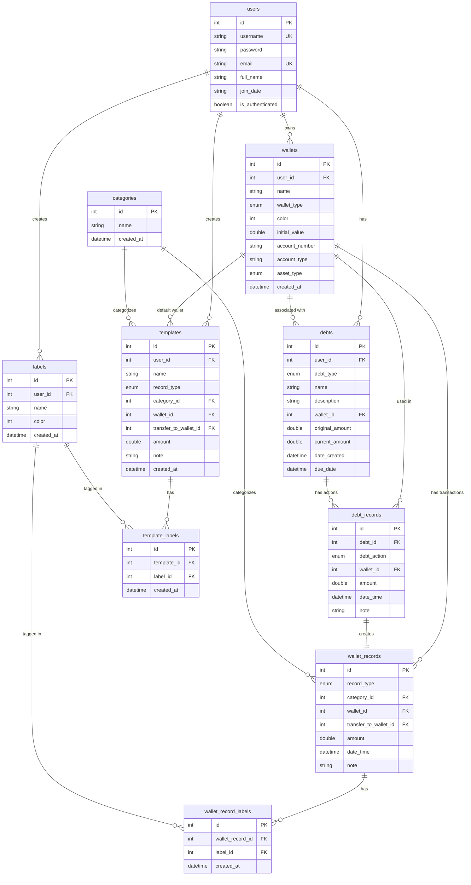

# Artha - Entity Relationship Diagram (ERD)

## Project Overview
Artha is a personal finance management application built with Flutter/Dart that helps users track their wallets, financial transactions, and debts.

---

## Entities and Attributes

### 1. users
Represents the authenticated users of the application.

| Attribute | Type | Constraints | Description |
|-----------|------|-------------|-------------|
| id | Integer | PK, AUTO_INCREMENT, NOT NULL | Unique identifier for the user |
| username | String | UNIQUE, NOT NULL | Unique username for login |
| password | String | NOT NULL | User password (currently hardcoded) |
| email | String | UNIQUE, NOT NULL | User email address |
| full_name | String | NULL | User's full name |
| join_date | String | NOT NULL | Date when user joined |
| is_authenticated | Boolean | NOT NULL | Current authentication status |

**Note**: Currently, the application uses hardcoded authentication. In a production system, this would be replaced with a proper user management system.

---

### 2. wallets
Represents financial accounts (bank account, e-wallet, investment account, cash, etc.).

| Attribute | Type | Constraints | Description |
|-----------|------|-------------|-------------|
| id | Integer | PK, AUTO_INCREMENT, NOT NULL | Unique identifier for the wallet |
| user_id | Integer | FK, NOT NULL | Reference to users.id (owner of the wallet) |
| name | String | NOT NULL | Display name of the wallet |
| wallet_type | WalletType (Enum) | NOT NULL | Type of wallet (manualInput, investment) |
| color | Color (Integer) | NOT NULL | Color code for UI representation |
| initial_value | Double | NOT NULL, DEFAULT 0.0 | Initial balance of the wallet |
| account_number | String | NULL | Account number (for manual input wallets) |
| account_type | String | NULL | Account type (Bank, E-wallet, Cash, etc.) |
| asset_type | AssetType (Enum) | NULL | Asset type for investment wallets (stocks, crypto) |
| created_at | DateTime | NOT NULL | Timestamp when wallet was created |

**Constraints:**
- UNIQUE (user_id, name) - Wallet names must be unique per user

**Enums:**
- **WalletType**: `manualInput`, `investment`
- **AssetType**: `stocks`, `crypto`
- **AccountType** (String): `Bank Account`, `E-Wallet`, `Cash`, `Savings`, `Credit Card`, `Debit Card`, `Investment Account`, `Business Account`, `Other`

---

### 3. categories
Represents transaction categories for wallet records.

| Attribute | Type | Constraints | Description |
|-----------|------|-------------|-------------|
| id | Integer | PK, AUTO_INCREMENT, NOT NULL | Unique identifier for the category |
| name | String | NOT NULL, UNIQUE | Name of the category |
| created_at | DateTime | NOT NULL | Timestamp when category was created |

**Constraints:**
- UNIQUE (name) - Category names must be unique

---

### 4. labels
Represents custom labels/tags that can be applied to wallet records.

| Attribute | Type | Constraints | Description |
|-----------|------|-------------|-------------|
| id | Integer | PK, AUTO_INCREMENT, NOT NULL | Unique identifier for the label |
| user_id | Integer | FK, NOT NULL | Reference to users.id (owner of the label) |
| name | String | NOT NULL | Name of the label |
| color | Color (Integer) | NULL | Optional color code for the label |
| created_at | DateTime | NOT NULL | Timestamp when label was created |

**Constraints:**
- UNIQUE (user_id, name) - Label names must be unique per user

---

### 5. wallet_records
Represents financial transactions (income, expense, or transfer between wallets).

| Attribute | Type | Constraints | Description |
|-----------|------|-------------|-------------|
| id | Integer | PK, AUTO_INCREMENT, NOT NULL | Unique identifier for the record |
| record_type | RecordType (Enum) | NOT NULL | Type of transaction (income, expense, transfer) |
| category_id | Integer | FK, NOT NULL | Reference to categories.id |
| wallet_id | Integer | FK, NOT NULL | Reference to wallets.id (source wallet) |
| transfer_to_wallet_id | Integer | FK, NULL | Reference to wallets.id (destination for transfers) |
| amount | Double | NOT NULL, > 0 | Transaction amount |
| date_time | DateTime | NOT NULL | Timestamp of the transaction |
| note | String | NULL | Additional notes or description |

**Enums:**
- **RecordType**: `income`, `expense`, `transfer`

---

### 6. templates
Represents templates for quickly creating repeated wallet records.

| Attribute | Type | Constraints | Description |
|-----------|------|-------------|-------------|
| id | Integer | PK, AUTO_INCREMENT, NOT NULL | Unique identifier for the template |
| user_id | Integer | FK, NOT NULL | Reference to users.id (owner of the template) |
| name | String | NOT NULL | Name of the template |
| record_type | RecordType (Enum) | NOT NULL | Type of transaction (income, expense, transfer) |
| category_id | Integer | FK, NOT NULL | Reference to categories.id |
| wallet_id | Integer | FK, NULL | Reference to wallets.id (can be changed when using template) |
| transfer_to_wallet_id | Integer | FK, NULL | Reference to wallets.id (for transfer templates) |
| amount | Double | NOT NULL, > 0 | Default amount for the template |
| note | String | NULL | Default note for the template |
| created_at | DateTime | NOT NULL | Timestamp when template was created |

**Enums:**
- **RecordType**: `income`, `expense`, `transfer`

**Constraints:**
- UNIQUE (user_id, name) - Template names must be unique per user

---

### 7. template_labels
Junction table for many-to-many relationship between templates and labels.

| Attribute | Type | Constraints | Description |
|-----------|------|-------------|-------------|
| id | Integer | PK, AUTO_INCREMENT, NOT NULL | Unique identifier for the junction record |
| template_id | Integer | FK, NOT NULL | Reference to templates.id |
| label_id | Integer | FK, NOT NULL | Reference to labels.id |
| created_at | DateTime | NOT NULL | Timestamp when association was created |

**Constraints:**
- UNIQUE (template_id, label_id) - A label can only be assigned once to a template

---

### 8. wallet_record_labels
Junction table for many-to-many relationship between wallet records and labels.

| Attribute | Type | Constraints | Description |
|-----------|------|-------------|-------------|
| id | Integer | PK, AUTO_INCREMENT, NOT NULL | Unique identifier for the junction record |
| wallet_record_id | Integer | FK, NOT NULL | Reference to wallet_records.id |
| label_id | Integer | FK, NOT NULL | Reference to labels.id |
| created_at | DateTime | NOT NULL | Timestamp when association was created |

**Constraints:**
- UNIQUE (wallet_record_id, label_id) - A label can only be assigned once to a record

---

### 9. debts
Represents money lent to others or owed by the user.

| Attribute | Type | Constraints | Description |
|-----------|------|-------------|-------------|
| id | Integer | PK, AUTO_INCREMENT, NOT NULL | Unique identifier for the debt |
| user_id | Integer | FK, NOT NULL | Reference to users.id (owner of the debt) |
| debt_type | DebtType (Enum) | NOT NULL | Type of debt (iLent, iOwe) |
| name | String | NOT NULL | Name of the person/entity |
| description | String | NOT NULL | Description or purpose of the debt |
| wallet_id | Integer | FK, NOT NULL | Reference to wallets.id |
| original_amount | Double | NOT NULL, > 0 | Original amount of the debt |
| current_amount | Double | NOT NULL, >= 0 | Current outstanding amount |
| date_created | DateTime | NOT NULL | When the debt was created |
| due_date | DateTime | NOT NULL | When the debt is due |

**Computed Properties:**
- `is_overdue`: Boolean - True if current date > due_date and current_amount > 0
- `is_paid`: Boolean - True if current_amount == 0
- `paid_amount`: Double - original_amount - current_amount
- `paid_percentage`: Double - (paid_amount / original_amount) * 100

**Enums:**
- **DebtType**: `iLent` (I lent money to someone), `iOwe` (I owe money to someone)

---

### 10. debt_records
Represents actions performed on a debt (repayment or increase).

| Attribute | Type | Constraints | Description |
|-----------|------|-------------|-------------|
| id | Integer | PK, AUTO_INCREMENT, NOT NULL | Unique identifier for the debt record |
| debt_id | Integer | FK, NOT NULL | Reference to debts.id |
| action | DebtAction (Enum) | NOT NULL | Type of action (repay, increaseDebt) |
| wallet_id | Integer | FK, NOT NULL | Reference to wallets.id |
| amount | Double | NOT NULL, > 0 | Amount of the action |
| date_time | DateTime | NOT NULL | When the action occurred |
| note | String | NULL | Additional notes |

**Enums:**
- **DebtAction**: `repay` (payment made), `increaseDebt` (debt increased)

**Business Logic:**
- When a DebtRecord is created, it automatically creates a corresponding WalletRecord
- The relationship between DebtRecord and WalletRecord actions:
  - **iLent + repay** → Income to account (they pay me back)
  - **iLent + increaseDebt** → Expense from account (I lend more)
  - **iOwe + repay** → Expense from account (I pay them back)
  - **iOwe + increaseDebt** → Income to account (they lend me more)

---

## Relationships

### Entity Relationship Diagram (Mermaid Syntax)



### Entity Relationship Diagram (PlantUML Syntax)

**Note**: This version uses entity diagram syntax. If you encounter Graphviz errors, you may need to install Graphviz (`brew install graphviz` on macOS).


### Relationship Details

#### 1. users → wallets (1:N)
- **Type**: One-to-Many
- **Description**: A user can own multiple wallets
- **Cardinality**: 1 users : 0..* wallets
- **Foreign Key**: wallets.user_id → users.id
- **Cascade**: When a user is deleted, all associated wallets are also deleted
- **Note**: Currently not explicitly stored in code, but should be implemented for multi-user support

#### 2. users → debts (1:N)
- **Type**: One-to-Many
- **Description**: A user can have multiple debts
- **Cardinality**: 1 users : 0..* debts
- **Foreign Key**: debts.user_id → users.id
- **Cascade**: When a user is deleted, all associated debts are also deleted
- **Note**: Currently not explicitly stored in code, but should be implemented for multi-user support

#### 3. users → labels (1:N)
- **Type**: One-to-Many
- **Description**: A user can create multiple labels
- **Cardinality**: 1 users : 0..* labels
- **Foreign Key**: labels.user_id → users.id
- **Cascade**: When a user is deleted, all associated labels are also deleted

#### 4. users → templates (1:N)
- **Type**: One-to-Many
- **Description**: A user can create multiple transaction templates
- **Cardinality**: 1 users : 0..* templates
- **Foreign Key**: templates.user_id → users.id
- **Cascade**: When a user is deleted, all associated templates are also deleted

#### 5. categories → wallet_records (1:N)
- **Type**: One-to-Many
- **Description**: A category can be used by multiple wallet records
- **Cardinality**: 1 categories : 0..* wallet_records
- **Foreign Key**: wallet_records.category_id → categories.id
- **Cascade**: When a category is deleted, prevent deletion if wallet_records exist (RESTRICT)

#### 6. categories → templates (1:N)
- **Type**: One-to-Many
- **Description**: A category can be used by multiple templates
- **Cardinality**: 1 categories : 0..* templates
- **Foreign Key**: templates.category_id → categories.id
- **Cascade**: When a category is deleted, prevent deletion if templates exist (RESTRICT)

#### 7. wallets → wallet_records (1:N)
- **Type**: One-to-Many
- **Description**: A wallet can have multiple transaction records
- **Cardinality**: 1 wallets : 0..* wallet_records
- **Foreign Key**: wallet_records.wallet_id → wallets.id
- **Note**: wallet_records.transfer_to_wallet_id also references wallets.id for transfer transactions
- **Cascade**: When a wallet is deleted, all associated wallet_records should be handled appropriately

#### 8. wallets → templates (1:N)
- **Type**: One-to-Many
- **Description**: A wallet can be used as default in multiple templates
- **Cardinality**: 1 wallets : 0..* templates
- **Foreign Key**: templates.wallet_id → wallets.id (nullable)
- **Cascade**: When a wallet is deleted, set wallet_id to NULL in templates (SET NULL)
- **Note**: Templates can have optional default wallet

#### 9. wallets → debts (1:N)
- **Type**: One-to-Many
- **Description**: A wallet can be associated with multiple debts
- **Cardinality**: 1 wallets : 0..* debts
- **Foreign Key**: debts.wallet_id → wallets.id
- **Cascade**: When a wallet is deleted, associated debts should be handled (either prevent deletion or cascade)

#### 10. wallets → debt_records (1:N)
- **Type**: One-to-Many
- **Description**: A wallet can be used in multiple debt record transactions
- **Cardinality**: 1 wallets : 0..* debt_records
- **Foreign Key**: debt_records.wallet_id → wallets.id
- **Cascade**: When a wallet is deleted, associated debt_records should be handled appropriately

#### 11. debts → debt_records (1:N)
- **Type**: One-to-Many
- **Description**: A debt can have multiple action records
- **Cardinality**: 1 debts : 0..* debt_records
- **Foreign Key**: debt_records.debt_id → debts.id
- **Cascade**: When a debt is deleted, all associated debt_records are also deleted

#### 12. debt_records → wallet_records (1:1)
- **Type**: One-to-One
- **Description**: Each debt record automatically creates a corresponding wallet record
- **Cardinality**: 1 debt_records : 1 wallet_records
- **Foreign Key**: wallet_records.id = 'debt_' + debt_records.id
- **Business Logic**: The wallet record type and category depend on the debt type and action
- **Cascade**: When a debt_record is deleted, the corresponding wallet_record is also deleted

#### 13. wallet_records ← wallet_record_labels → labels (M:N)
- **Type**: Many-to-Many
- **Description**: A wallet record can have multiple labels, and a label can be applied to multiple wallet records
- **Cardinality**: * wallet_records : * labels
- **Junction Table**: wallet_record_labels
- **Foreign Keys**:
  - wallet_record_labels.wallet_record_id → wallet_records.id
  - wallet_record_labels.label_id → labels.id
- **Cascade**: When a wallet_record or label is deleted, the corresponding junction records are also deleted

#### 14. templates ← template_labels → labels (M:N)
- **Type**: Many-to-Many
- **Description**: A template can have multiple labels, and a label can be applied to multiple templates
- **Cardinality**: * templates : * labels
- **Junction Table**: template_labels
- **Foreign Keys**:
  - template_labels.template_id → templates.id
  - template_labels.label_id → labels.id
- **Cascade**: When a template or label is deleted, the corresponding junction records are also deleted

---

## Database Schema (Normalized)

### Suggested SQL Schema for Future Implementation

```sql
-- Users table
CREATE TABLE users (
    id INT AUTO_INCREMENT PRIMARY KEY,
    username VARCHAR(255) NOT NULL UNIQUE,
    password VARCHAR(255) NOT NULL,
    email VARCHAR(255) NOT NULL UNIQUE,
    full_name VARCHAR(255),
    join_date DATE NOT NULL,
    is_authenticated BOOLEAN DEFAULT FALSE,
    created_at TIMESTAMP DEFAULT CURRENT_TIMESTAMP
);

-- Wallets table
CREATE TABLE wallets (
    id INT AUTO_INCREMENT PRIMARY KEY,
    user_id INT NOT NULL,
    name VARCHAR(255) NOT NULL,
    wallet_type VARCHAR(50) NOT NULL, -- manualInput, investment
    color INTEGER NOT NULL,
    initial_value DECIMAL(15, 2) NOT NULL DEFAULT 0.00,
    account_number VARCHAR(255),
    account_type VARCHAR(100),
    asset_type VARCHAR(50), -- stocks, crypto
    created_at TIMESTAMP NOT NULL DEFAULT CURRENT_TIMESTAMP,
    FOREIGN KEY (user_id) REFERENCES users(id) ON DELETE CASCADE,
    UNIQUE (user_id, name)
);

-- Categories table
CREATE TABLE categories (
    id INT AUTO_INCREMENT PRIMARY KEY,
    name VARCHAR(255) NOT NULL UNIQUE,
    created_at TIMESTAMP NOT NULL DEFAULT CURRENT_TIMESTAMP
);

-- Labels table
CREATE TABLE labels (
    id INT AUTO_INCREMENT PRIMARY KEY,
    user_id INT NOT NULL,
    name VARCHAR(255) NOT NULL,
    color INTEGER,
    created_at TIMESTAMP NOT NULL DEFAULT CURRENT_TIMESTAMP,
    FOREIGN KEY (user_id) REFERENCES users(id) ON DELETE CASCADE,
    UNIQUE (user_id, name)
);

-- Templates table
CREATE TABLE templates (
    id INT AUTO_INCREMENT PRIMARY KEY,
    user_id INT NOT NULL,
    name VARCHAR(255) NOT NULL,
    record_type VARCHAR(50) NOT NULL, -- income, expense, transfer
    category_id INT NOT NULL,
    wallet_id INT,
    transfer_to_wallet_id INT,
    amount DECIMAL(15, 2) NOT NULL,
    note TEXT,
    created_at TIMESTAMP NOT NULL DEFAULT CURRENT_TIMESTAMP,
    FOREIGN KEY (user_id) REFERENCES users(id) ON DELETE CASCADE,
    FOREIGN KEY (category_id) REFERENCES categories(id) ON DELETE RESTRICT,
    FOREIGN KEY (wallet_id) REFERENCES wallets(id) ON DELETE SET NULL,
    FOREIGN KEY (transfer_to_wallet_id) REFERENCES wallets(id) ON DELETE SET NULL,
    UNIQUE (user_id, name)
);

-- Template labels junction table (many-to-many)
CREATE TABLE template_labels (
    id INT AUTO_INCREMENT PRIMARY KEY,
    template_id INT NOT NULL,
    label_id INT NOT NULL,
    created_at TIMESTAMP NOT NULL DEFAULT CURRENT_TIMESTAMP,
    FOREIGN KEY (template_id) REFERENCES templates(id) ON DELETE CASCADE,
    FOREIGN KEY (label_id) REFERENCES labels(id) ON DELETE CASCADE,
    UNIQUE (template_id, label_id)
);

-- Wallet records table
CREATE TABLE wallet_records (
    id INT AUTO_INCREMENT PRIMARY KEY,
    record_type VARCHAR(50) NOT NULL, -- income, expense, transfer
    category_id INT NOT NULL,
    wallet_id INT NOT NULL,
    transfer_to_wallet_id INT,
    amount DECIMAL(15, 2) NOT NULL,
    date_time TIMESTAMP NOT NULL,
    note TEXT,
    created_at TIMESTAMP DEFAULT CURRENT_TIMESTAMP,
    FOREIGN KEY (category_id) REFERENCES categories(id) ON DELETE RESTRICT,
    FOREIGN KEY (wallet_id) REFERENCES wallets(id) ON DELETE CASCADE,
    FOREIGN KEY (transfer_to_wallet_id) REFERENCES wallets(id) ON DELETE SET NULL
);

-- Wallet record labels junction table (many-to-many)
CREATE TABLE wallet_record_labels (
    id INT AUTO_INCREMENT PRIMARY KEY,
    wallet_record_id INT NOT NULL,
    label_id INT NOT NULL,
    created_at TIMESTAMP NOT NULL DEFAULT CURRENT_TIMESTAMP,
    FOREIGN KEY (wallet_record_id) REFERENCES wallet_records(id) ON DELETE CASCADE,
    FOREIGN KEY (label_id) REFERENCES labels(id) ON DELETE CASCADE,
    UNIQUE (wallet_record_id, label_id)
);

-- Debts table
CREATE TABLE debts (
    id INT AUTO_INCREMENT PRIMARY KEY,
    user_id INT NOT NULL,
    debt_type VARCHAR(50) NOT NULL, -- iLent, iOwe
    name VARCHAR(255) NOT NULL,
    description TEXT NOT NULL,
    wallet_id INT NOT NULL,
    original_amount DECIMAL(15, 2) NOT NULL,
    current_amount DECIMAL(15, 2) NOT NULL,
    date_created TIMESTAMP NOT NULL,
    due_date TIMESTAMP NOT NULL,
    created_at TIMESTAMP DEFAULT CURRENT_TIMESTAMP,
    FOREIGN KEY (user_id) REFERENCES users(id) ON DELETE CASCADE,
    FOREIGN KEY (wallet_id) REFERENCES wallets(id) ON DELETE CASCADE
);

-- Debt records table
CREATE TABLE debt_records (
    id INT AUTO_INCREMENT PRIMARY KEY,
    debt_id INT NOT NULL,
    action VARCHAR(50) NOT NULL, -- repay, increaseDebt
    wallet_id INT NOT NULL,
    amount DECIMAL(15, 2) NOT NULL,
    date_time TIMESTAMP NOT NULL,
    note TEXT,
    created_at TIMESTAMP DEFAULT CURRENT_TIMESTAMP,
    FOREIGN KEY (debt_id) REFERENCES debts(id) ON DELETE CASCADE,
    FOREIGN KEY (wallet_id) REFERENCES wallets(id) ON DELETE CASCADE
);

-- Indexes for performance
CREATE INDEX idx_wallets_user ON wallets(user_id);
CREATE INDEX idx_labels_user ON labels(user_id);
CREATE INDEX idx_templates_user ON templates(user_id);
CREATE INDEX idx_templates_category ON templates(category_id);
CREATE INDEX idx_templates_wallet ON templates(wallet_id);
CREATE INDEX idx_template_labels_template ON template_labels(template_id);
CREATE INDEX idx_template_labels_label ON template_labels(label_id);
CREATE INDEX idx_wallet_records_category ON wallet_records(category_id);
CREATE INDEX idx_wallet_records_wallet ON wallet_records(wallet_id);
CREATE INDEX idx_wallet_records_date ON wallet_records(date_time);
CREATE INDEX idx_wallet_records_transfer ON wallet_records(transfer_to_wallet_id);
CREATE INDEX idx_wallet_record_labels_record ON wallet_record_labels(wallet_record_id);
CREATE INDEX idx_wallet_record_labels_label ON wallet_record_labels(label_id);
CREATE INDEX idx_debts_user ON debts(user_id);
CREATE INDEX idx_debts_type ON debts(debt_type);
CREATE INDEX idx_debts_wallet ON debts(wallet_id);
CREATE INDEX idx_debt_records_debt ON debt_records(debt_id);
CREATE INDEX idx_debt_records_wallet ON debt_records(wallet_id);
CREATE INDEX idx_debt_records_date ON debt_records(date_time);
```

---

## Data Flow Diagrams

### 1. Wallet Balance Calculation Flow
```
Initial Wallet Balance (initial_value)
  + All Income Records (where wallet_id = wallet.id)
  - All Expense Records (where wallet_id = wallet.id)
  - All Transfer Records (where wallet_id = wallet.id) [outgoing]
  + All Transfer Records (where transfer_to_wallet_id = wallet.id) [incoming]
= Current Wallet Balance
```

### 2. Debt Record Creation Flow
```
User Creates DebtRecord
  ↓
Update Debt.current_amount
  ↓
Create corresponding WalletRecord based on:
  - Debt.type (iLent/iOwe)
  - DebtRecord.action (repay/increaseDebt)
  ↓
Update Wallet Balance (via WalletRecord)
```

### 3. Transaction Type Mapping (Debt → Wallet)
| Debt Type | Action | Wallet Record Type | Category | Effect on Wallet Balance |
|-----------|--------|-------------------|----------|--------------------------|
| iLent | repay | income | Debt Repayment | + amount (receive payment) |
| iLent | increaseDebt | expense | Debt Increase | - amount (lend more money) |
| iOwe | repay | expense | Debt Repayment | - amount (pay debt) |
| iOwe | increaseDebt | income | Debt Increase | + amount (borrow more) |

---

## Business Rules & Constraints

### Wallet Rules
1. Wallet names must be unique per user
2. Initial value (initial_value) cannot be negative
3. Color is required for UI differentiation
4. Investment wallets must have an asset_type
5. Manual input wallets should have account_type

### WalletRecord Rules
1. Amount must be greater than 0
2. Transfer records must have a transfer_to_wallet_id
3. Category must match the record type
4. wallet_id and transfer_to_wallet_id must reference valid Wallet IDs
5. Records are sorted by date_time descending
6. A transfer cannot have the same wallet_id and transfer_to_wallet_id

### Debt Rules
1. original_amount must be greater than 0
2. current_amount must be between 0 and original_amount
3. current_amount cannot be negative
4. A debt is considered "paid" when current_amount = 0
5. A debt is "overdue" when current date > due_date and current_amount > 0

### DebtRecord Rules
1. Amount must be greater than 0
2. When action = repay:
   - Debt.current_amount decreases by amount
   - Cannot reduce current_amount below 0
3. When action = increaseDebt:
   - Debt.current_amount increases by amount
4. Each DebtRecord automatically creates a WalletRecord
5. Deleting a DebtRecord reverses the amount change and deletes the WalletRecord

---

## Current Data Storage

**Note**: The current implementation uses in-memory storage with singleton services:
- `WalletService` - manages Wallet entities
- `RecordService` - manages WalletRecord entities
- `DebtService` - manages Debt and DebtRecord entities
- `AuthService` - manages authentication state

**Current Implementation Limitations**:
- Foreign keys currently reference wallet names instead of wallet IDs
- No user ID tracking (single-user application)
- Data is not persisted (lost on app restart)
- No proper referential integrity enforcement

### Future Improvements
1. **Critical**: Refactor foreign keys to use IDs instead of names
   - Change WalletRecord.account → WalletRecord.wallet_id
   - Change Debt.account → Debt.wallet_id
   - Change DebtRecord.account → DebtRecord.wallet_id
2. **Critical**: Add user_id to Wallet and Debt entities for multi-user support
3. **Critical**: Add id field to User entity
4. Implement persistent storage (SQLite, Hive, or cloud database)
5. Add proper user management with secure authentication
6. Implement foreign key constraints and referential integrity
7. Implement data synchronization across devices
8. Add data backup and restore functionality
9. Implement data export (CSV, PDF)
10. Add multi-currency support
11. Implement recurring transactions
12. Add budgeting features
13. Add data analytics and reporting

---

## Summary Statistics

### Entity Count
- **10 Main Entities**: users, wallets, categories, labels, wallet_records, templates, template_labels, wallet_record_labels, debts, debt_records
- **14 Relationships**: 11 one-to-many, 1 one-to-one, 2 many-to-many (16 relationship edges in diagram)
- **4 Enums**: WalletType, AssetType, RecordType, DebtType, DebtAction

### Key Features
- Multi-wallet management
- Transaction tracking (income, expense, transfer)
- Custom categories and labels for transactions
- Many-to-many labeling system for flexible tagging
- **Transaction templates for quick entry of repeated records**
- Debt management (lending and borrowing)
- Automatic balance calculation
- Debt-to-wallet record synchronization
- Investment tracking (stocks, crypto)

---

**Document Version**: 1.0
**Last Updated**: October 4, 2025
**Project**: Artha - Personal Finance Manager
**Technology**: Flutter/Dart
